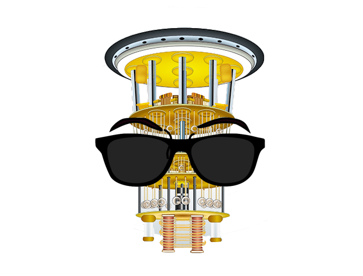
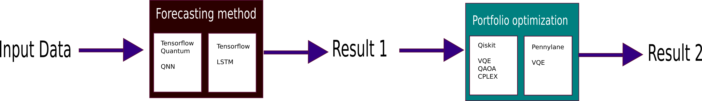

# Introduction

# Quantum Counselor for Portfolio Investment
The Quantum Counselor for portfolio investment is a tool with two main objectives: forecasting the trend of assets price and optimizing portfolio returns both using quantum computing techniques. For the case of the forecasting method, we use a hybrid method that combines a deep learning model of classical LSTM layers with quantum layers. For the case of portfolio optimization, the quantum algorithms of QAOA and VQE are used to solve the problem and will be compared with CPLEX, a classical solver. Both tools are deeply connected because the forecasted price of the different assets is used for the cost function construction.

# Outline

1. Stocks forecasting using a QNN

2. Portfolio Optimization.

3. Stocks Selection.

4. Model XS (3 Stocks, 2 periods), QAOA and VQE with SPSA and COBYLA classical optimizers.

5. Model S  (5 Stocks, 3 periods), QAOA and VQE with SPSA and COBYLA classical optimizers.

6. Model M  (7 Stocks, 3 periods), QAOA and VQE with SPSA and COBYLA classical optimizers.

7. A novel approach for the Portfolio Optimization

8. References

# 1. Stocks forecasting using a QNN

# 2. Portfolio optimization

For portfolio optimization, we use the modern portfolio theory where we is wanted to maximize the return of an investment while keeping the risk of losing money low. We based or method in the work of Mugel et al. [<b>[1]<i>](https://doi.org/10.1103/PhysRevResearch.4.013006) where the cost function is described by:

## Proposal 
This project uses different methods and techniques of Quantum computing and Quantum machine learning as:

- QNN,
- VQE,
- QAOA.

and classical methods as  ANN, LSTM, Optimizers (Cobyla) 

For the case of the Hibryd LSTM we use proposal to design:

# Prelimineries result 

## using the first layer as  QNN

## using the last layer as  QNN

## mock data for the portfolio part

# Progress

Positive results for each module separately, next step, connect the results of each block and compare the cases of each with their respective classical equivalence.

# References 
[1] Mugel, S., Kuchkovsky, C., Sánchez, E., Fernández-Lorenzo, S., Luis-Hita, J., Lizaso, E., & Orús, R. (2022). Dynamic portfolio optimization with real datasets using quantum processors and quantum-inspired tensor networks. Physical Review Research, 4(1), 1–13. https://doi.org/10.1103/PhysRevResearch.4.013006.

[2] Chen, Samuel & Yoo, Shinjae & Fang, Yao-Lung. (2020). Quantum Long Short-Term Memory. 

[3] Bausch, Johannes. (2020). Recurrent Quantum Neural Networks. 

[4] Verdon, Guillaume & Broughton, Michael & Mcclean, Jarrod & Sung, Kevin & Babbush, Ryan & Jiang, Zhang & Neven, Hartmut & Mohseni, M.. (2019). Learning to learn with quantum neural networks via classical neural networks. 
