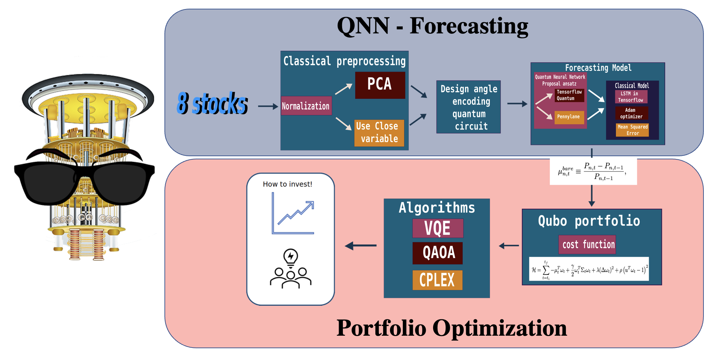
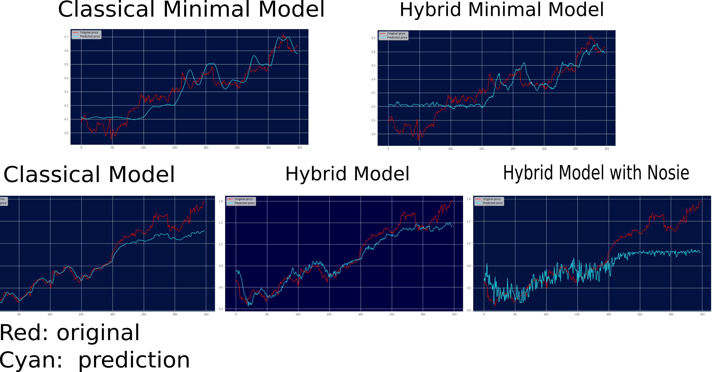
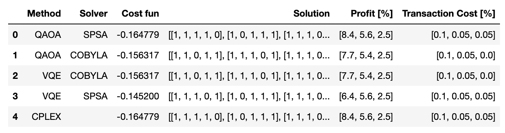

# Introduction

# Quantum Counselor for Portfolio Investment
The Quantum Counselor for portfolio investment is a tool with two main objectives: forecasting the trend of assets price and optimizing portfolio returns both using quantum computing techniques. For the case of the forecasting method, we use a hybrid method for a Quantum neural network (**QNN**) that combines a deep learning model of classical LSTM layers with quantum layers. For the case of portfolio optimization, we convert the optimization problem into a Quadratic unconstrained binary optimization (**QUBO**) problem and using the quantum algorithms of Quantum Approximate Optimization Algorithm (**QAOA**) and the variational quantum eigensolver (**VQE**) solve the problem. Additionally, we use the classical solver CPLEX for comparison with the other two methods. Both tools are deeply connected because the forecasted price of the different assets is used for the optimization protfolio cost function construction.

### Requirements
A library was built with the name tfqml.py to store all the dependencies, classes and methods that are used in this work, these classes are

|ClassicalPreprocessing  | QuantumPreprocessing | CircuitLayer | QuantumModel
|----------------------- | -------------------- | ------------ | -----------------
| create_dataset()       | convert2circuit()    | add_layer()  | quantum_circuit()
| preprocessing()        | data2qubits()        |              |
|                        | print_circuit()      |              |

and the methods 
- visualization() 
- save_data()

the dependencies are:

| numpy: 1.20.1               | sklearn: 0.24.1          | sympy: 1.7.1                        | 
|-----------------------------| ------------------------ | ----------------------------------- | 
| pandas: 1.2.3               | cirq : 0.13.1            | pennylane: 0.21.0                   | 
| docplex version:  2.22.213  | tensorflow_quantum: 0.6.1|  qiskit version:  0.19.2            |
| matplotlib: 3.4.1           | tensorflow: 2.7.0        |  qiskit_optimization version:  0.3.1|

# Outline

1. Stocks forecasting using a QNN

2. Portfolio Optimization. **File:** [Portfolio-Optimization.ipynb](https://github.com/alejomonbar/Quantum-Counselor-for-Portfolio-Investment/blob/main/Portfolio-Optimization.ipynb)

    2.1 Model XS (3 Stocks, 2 periods), QAOA and VQE with SPSA and COBYLA classical optimizers.

    2.2 Model S  (5 Stocks, 3 periods), QAOA and VQE with SPSA and COBYLA classical optimizers.

    2.3 Model M  (8 Stocks, 3 periods), QAOA and VQE with SPSA and COBYLA classical optimizers.

3. A novel approach for the Portfolio Optimization

4. References

# 1. Stocks forecasting using a QNN

One of the principal requirements for portfolio optimization is the ability to predict the price trend *P_{n,t}* for *N* assets during some periods of time. In this work, our first objective is to show the capabilities of a quantum neural network (QNN) to predict the trend of a set of stocks. Specifically, we select 8 stocks from 8 conglomerates based on the dataset of Xu et al. [[2]](https://aclanthology.org/P18-1183/): 

- Basic Materials: TOTAL S.A. "TOT"

- Consumer Goods: Appel Inc. "AAPL"

- Healthcare: AbbVie Inc. "ABBV"

- Services: Wall-Mart Stores Inc. "WMT"

- Utilites: Duke energy corporation "DUK"

- Financial: HSBS Holding pcl "HSBC"

- Industrial Goods: ABB Ltd. "ABB"

- Technology: China Mobile Limited "CHL"

The information comes from Sep 2012 to Sep 2017 with daily Technical information of Open, High, Low, Close, Adj Close, and Volume for the stocks price.

<figure>
 
<figcaption align = "center"><b>Fig.1 - Stocks trend for the 8 conglomerates. We used the closed price as the prediction parameter.</b></figcaption>
</figure>
 
 

From here, we use a **QNN** to predict the trend in the price of the stock. The results of the forecasting are stored in **stocks_forecasting**

We design a quantum circuit  for encoding all the values in the data set, using 30 data per instance with this proposal we reduce to an output of 10.

 

The ansatz for the QNN follows the structure of the figure below structure, and using for the model 2 layers of this ansatz.

we design two proposal of solutions with this quantum layer.

Using the minimum  parameters for predict the stock.

One result of the  classical minimal  model

One result of the  hybrid minimal  model

Error between Classic and our  Hybrid proposal

Using more parameters to obtain the less error for all the stocks.

# 2. Portfolio optimization

The results of three portfolio cases are presented in this section: 

- XS model with 3 stocks and 2 periods of time
- S model with 5 stocks and 3 periods of time
- M model with 7 stocks and 3 periods of time.

For portfolio optimization, we use the modern portfolio theory where it is wanted to maximize the return of an investment while keeping the risk of losing money low. We based or cost function in the work of Mugel et al. [[1]](https://doi.org/10.1103/PhysRevResearch.4.013006) where the cost function is described by:

The equation shown above is encoded using the function *Model* from **docplex** a classical library from IBM for optimization problems. Next, using the *qiskit_optimization* function *QuadraticProgramToQubo*, the problem is translated to the **QUBO** representation. The **QUBO** is the input to the functions **QAOA** and **VQE** from **qiskit**. They translate the problem to the needed *Hamiltonian* and solve it using a hybrid model. In our case, we test two classical solvers the Simultaneous Perturbation Stochastic Approximation (**SPSA**) and Constrained Optimization BY Linear Approximation (**COBYLA**).

*Fig. 2* shows the training of the S -model and the S -NEW model (explained in **Section 3**) using VQE and QAOA. Here, it is observed that the VQE has a smoother way to come to the optimal point for both cases COBYLA and SPSA while the QAOA for 1 repetition is not comming to the optimal point contrary to the 2 repetitions where the optimal is found.

<figure>
 
<figcaption align = "center"><b>Fig.2 - Cost function optimization using two quantum algorithms VQE and QAOA with classical optimizers SPSA and COBYLA. The red results are for the model S while the green for a novel approach explained in **Section 3** a</b></figcaption>
</figure>
 
 

## 2.1 Model XS
The Table below shows the results of the XS model, with 3 stocks "AAPL","ABB", and "ABBV". We consider a transaction cost of 0.1% and holding period of 30 (this means that the stock should remain with us 30 days). From the perspective of the forecasting data, we take the last two months of prediction. 

 

## 2.2 Model S
Model S is similar to model XS the only condition that changes are the stocks chosen in this case they are "AAPL","ABB", "ABBV","TOT", and "DUK". In this case, the only quantum algorithm that converges to the optimal is QAOA with SPSA. However, we only consider one repetition of the mixer and the Hamiltonian of this case, as we show un Fig.2 for 2 repetitions the QAOA converges. Similarly, the VQE in this case takes an ansatz from the function *TwoLocal* and it is truncated to a maximum number of 50 iterations, increasing the number of iterations will make the 

 

## 2.3 Model M
Model M is similar to model S and XS the only variation is the stocks chosen in this case they are "AAPL","ABB", "ABBV","CHL", "DUK", "HSBC", "TOT", and "WMT". In this case, as the problem size includes 24 qubits and we found problems executing it on the IBM quantum simulator *ibmq_quasm_simulator*, we have to run it locally and we could only get results for QAOA COBYLA and SPSA, in the coming days the results for VQE will be presented. Eventhough QAOA does not converge for any of the two cases, it only uses one repetiton incresing this number and the maximum number of iterations will improve the result. However, this is still a good approximation of the optimal.

 

# 3. A novel approach to the portfolio cost function

We introduce two modifications to the objective function that we think will improve the profit reached by a single investment. We call it, the **budget increment opportunity**. In this case, we see some situations where the market offers advantages to invest in some specific periods of time. In such periods, we want the budget constraint to be weak, allowing surpassing the budget established in the problem. This move is possible thanks to two considerations, the bare return of all the stocks is high and the uncertainty in the forecasting price of the stocks is low. We call the forecasting uncertainty with the greek letter kappa and it is the mean relative error *mre* of the test cases in the QNN training. The second modification is the addition of a second risk term, this term is based on the uncertainty mentioned before. Therefore, if the forecasting prediction is low for some assets, the optimization will avoid them. The Equation below describes our new approach:

 

Here, we present results only for model S. Fig. 3 shows the different investment trajectories based on our new approach. VQE SPSA and CPLEX choose a trajectory that increases to 125% of the budget. This is a strategy that increases the profit with a small risk. Once, the two first periods of good prospects have passed, the budget investment goes back to the maximum budget of 100%. 

<figure>

 
<figcaption align = "center"><b>Fig.3 - New method investment trayectory  </b></figcaption>
</figure>
 
 

Finally, Fig. 4 shows the profit made with the method described in section 2 and our new approach. Here, increasing the budget invested in the two first periods makes a higher profit compared with the first approach.

<figure>

 
<figcaption align = "center"><b>Fig.4 - Profit made with the two different approaches</b></figcaption>
</figure>
 
 

## Proposal 
This project uses different methods and techniques of Quantum computing and Quantum machine learning as:

- QNN,
- VQE,
- QAOA.

and classical methods as  ANN, LSTM, Optimizers (Cobyla) 

For the case of the Hibryd LSTM we use proposal to design:

# Prelimineries result 

## using the first layer as  QNN

## using the last layer as  QNN

## mock data for the portfolio part

# Progress

Positive results for each module separately, next step, connect the results of each block and compare the cases of each with their respective classical equivalence.

# References 
[1] Mugel, S., Kuchkovsky, C., Sánchez, E., Fernández-Lorenzo, S., Luis-Hita, J., Lizaso, E., & Orús, R. (2022). Dynamic portfolio optimization with real datasets using quantum processors and quantum-inspired tensor networks. Physical Review Research, 4(1), 1–13. https://doi.org/10.1103/PhysRevResearch.4.013006.

[2] Chen, Samuel & Yoo, Shinjae & Fang, Yao-Lung. (2020). Quantum Long Short-Term Memory. 

[3] Bausch, Johannes. (2020). Recurrent Quantum Neural Networks. 

[4] Verdon, Guillaume & Broughton, Michael & Mcclean, Jarrod & Sung, Kevin & Babbush, Ryan & Jiang, Zhang & Neven, Hartmut & Mohseni, M.. (2019). Learning to learn with quantum neural networks via classical neural networks. 
